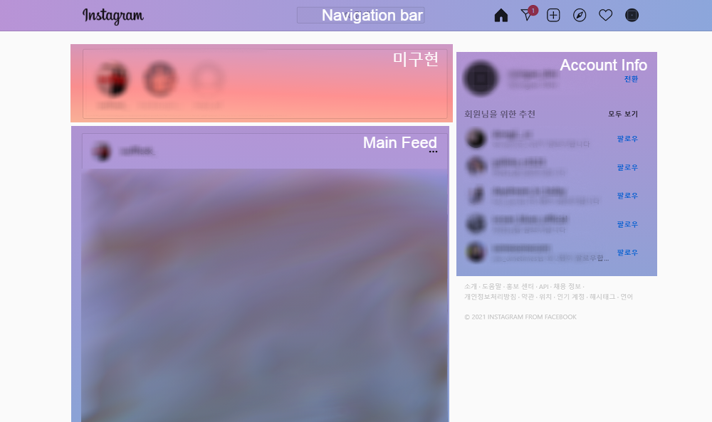
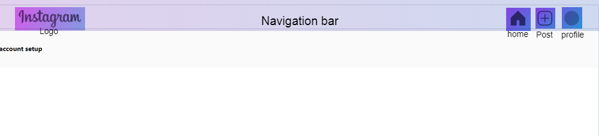
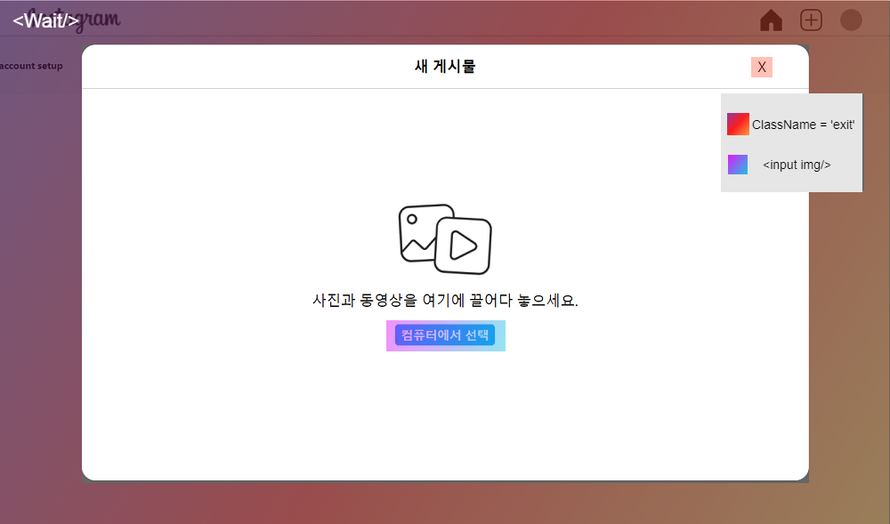
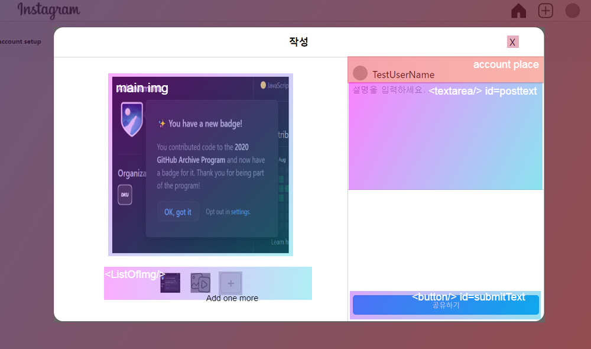
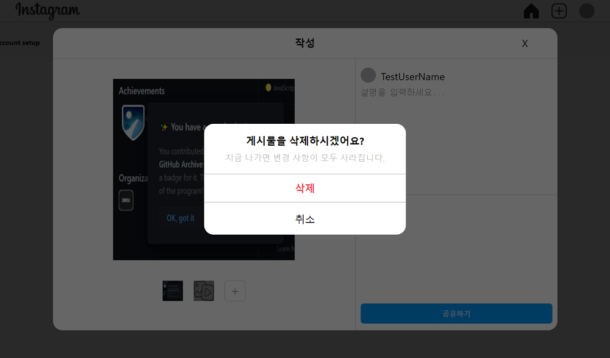

<h2>8월 3~4주 회고</h2>

<h4>진행했었던 일</h4>

* Instagram clonning

전번부터 진행했던 인스타 클로닝을 이제 직접 구현하기 시작했다.

로그인 page와, Feed를 보여주는 main page(가칭) 중에 main page를 먼저 구현하도록 결정했고,

main page는 < App /> 이라는 최상위 Comp아래에서, < NavigationBar/>, < MainFeed/>, < AccountInfo/> 세 개의 하위 Comp로 나누었다.

 

이중에, 첫번째로, < NavigationBar/>작성을 시작했는데, 이 Comp의 주요 기능은, 항상 fixed되어 사이트 사용중 navigation의 역할을 수행함과 동시에, 현제 log-in 된 계정의 profile을 표시해주고, 새로운 feed를 작성할 수 있는 Post기능이다. 원본 사이트에는 이 외에도 검색등 다른 다양한 기능이 많다만, 일단은 위의 기능을 먼저 초점을 맞추어 개발하였다.

<h5> < NavigationBar/> 구조 </h5>

< NavigationBar/>

- < logo img/>
- < home link/>
- < Post/>
  - < Wait/>
  - < Write/>

<h4>Cloned website</h4>

Logo와, Home은 react-route-dom을 이용해, '/'로 바로 라우팅을 해준다. profile은 user의 고유한 profile Image를 서버에서 가져와 표시해준다. 핵심기능인 Post는, 두가지의 상태를 가지는 Comp로 구성되는데, 첫번째로는, 이미지를 입력받기 이전의 기다리는 상태인 Wait상태이다.

Post 기호를 클릭하게되면, '/post' 로 라우팅되며, < Wait/>을 기본 홈위에 띄워주게 된다.  < Wait/>은 OnClick event로 exitpost라는 탈출 함수를 실행시키게 되는데, 이때 클릭한 target의 classList를 검사해, 'exit'이라는 class를 가지고 있는지 검사하고, target의 class가 'exit'이고 동시에 input된 image가 없으면 props로 전달된 history stack에 '/'을 push한다. button은 display none으로 가려놓은 input을 useRef로 불러와 Onclick event로 연결되어 있으며, image 파일을 가져오도록 설정하였다.

이제 버튼을 눌러, 이미지를 입력하여 useState로 선언된 listOfImg에 push하면, 화면은 Write 상태로 넘어가는데,

Write의 왼쪽은 upload될 image를 미리볼 수 있다. state인 listOfImg는 바로 Comp의 < ListOfImg/>에 연동되어 업로드 될 이미지를 리스트 형식으로 표시하고, length가 3이 되기 전까지 추가로 이미지를 업로드 할 수 있는 Add one more 버튼이 표시된다. < ListOfImg/>에서 클릭된 이미지는 main img에 표시되며, 선택되지 못한 index의 이미지들은 css에서 bright 50%를 주어 선택여부를 직관적으로 표시하였다.

우측 화면에서는, 작성중인 user를 볼 수 있는 account place와, feed의 content가 될 string를 받는 textarea가 있고, button은 Onclick 이벤트로 입력된 모든 content를 묶어 JSON으로 만들어 console로 출력한다. 향후 백엔드단과 엮이며 이 JSON을 POST로 서버로 쓰여질 예정이다.

그리고 입력도중 오클릭으로 인한 홈으로 라우팅되는걸 방지하기 위해,  listOfImg의 length가 1 이상일 경우에는, 다시한번 탈출을 묻는 확인창인 < AskOneMore/> 를 표시한다.

개발 후 소감은, Post라는 하나의 Comp안에 너무 많은 기능을 우겨넣은거 같다.  좀더 기능별로 구별하여 하위 Comp를 여러개 작성해 유 보수를 쉽게 설계해야했을탠데...

8월 3~4주 회고 끝.
