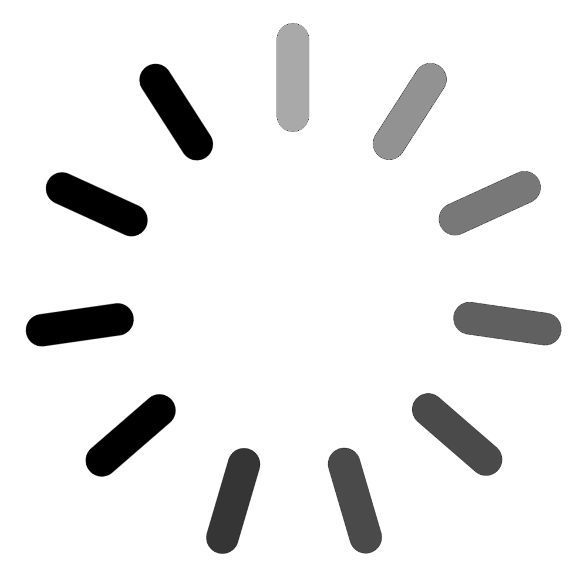

<h1> 9월 첫째주 회고</h1>

<h4>1주간 진행한 것</h4>

* 인스타그램 클로닝.


<h5>인스타그램 클로닝</h5>

지난주에 < NavigationBar/> 부분을 작성 완료하고, < MainFeed/>로 넘어왔다.

< MainFeed/> Component는 비동기 데이터 처리를 요구하는 comp가 될 예정이다.<br/> 로그인 이후에 MainPage로 다이렉트 되면서, 서버에 피드 데이터를 쿼리를 보내고, 피드 데이터를 받아오기 전까지는 로딩중인걸 보여 줄 수 있는 Comp인 < FeedLoadingScreen/>이 Feed의 자리를 대체하게 된다.

받아올 Feed데이터는 이후 가공되어서,<br/>

```js
feedData = [ 
    
    feedNo01 = { 
        writerName: str,
        writerProfile: str(url),
    	feed img: str(url), 
    	feed content: str, 
    	is I liked: boolean, 
    	likednumber: int, 
    	comment list : [ 
    		comment01 = { 
    			commentWriterName: str, 
    			commentWriterProfile: srt(url),
                commentContent: str, 
                isILikeThisComent: boolean,
                whoLikedThisComent: [ 
                    likedAccount01: { 
                    	accountName : str,
                    	accountProfile: srt(url)
                    }, 
                    likedAccount02: {
                        ...
                    },
                        ... 
                ]},
               
               comment02 = {
                   ...
               },
               ...
     ]}, 
     feedNo02 = {
                   ...
               },
    ...
]
```

형태로 저장되게 된다.

받아온 데이터는 list가 되어, list.forEach로 동적으로 생성된 feed jsx를 묶어서 리턴될 예정이다.

또한, 비동기 함수인 LoadFeed가 실행될 동안, react는 Feed의 화면을 잡고 있을 로딩 인디케이터를 표시해줘야 하는데,

이를 < FeedLoadingScreen/> 이 담당한다.

< FeedLoadingScreen/>의 완성된 모습은


로딩중임을 유져에게 표시 할 수 있는 원형의 로딩아이콘이 위에서 회전중이고,<br/> 또한 feed의 자리게 될 부분에 div 태그를 선언해, 데이터를 가져오는 중임을 표시하였다.

feed의 위에서 돌아가는 아이콘은,



저작권 문제로, 투명한 배경을 가진 아이콘을 다운받기 힘들어, 그냥 직접 만들어버렸다.

이 아이콘은 1.5s 의 주기를 가지고, transform: rotate(0deg to 360deg)로 회전하게 되는데,<br/> animation의 timing func은, steps(11,end)로 정확히 11/360deg만큼씩 회전하게 된다.<br/> 따라서 유저는 icon 자체가 회전한다기 보단, 내부의 눈금이 하나씩 돌아가는것 처럼 느끼게 되는것이다.


나머지 div태그의 animation은, 처음에는 liner-gradient의 % 변화를 주어서 선언을 해 보았지만, 이러면 animation이 연속적으로 보이지 않는다는 문제가 있어서 좀 더 구글링을 해 보니, background의 liner-gradient를 animation을 줄 때는, 흔히 backgrount-size를 100% 보다 크게 하여서, 시간상동안 background-position을 변화시켜 마치 liner-gradient가 변화하는것 처럼 작성한다는걸 알게되었다.

아마 css 구현상 문제로 인해 이러한 방법을 사용하는 것으로 이해했다.

또한 div 태그의 background가 변화하는것 처럼 사용할 수 있는 방법중 하나는, 같은 위치에 다른 background를 가진 div 태그를 두개 겹처놓고, animation으로 두 div 태그의 opaticy를 변화시켜 사용하는 방법 또한 있지만,<br/> 이러한 방법은 반응형 웹을 짤 때 포지션 위치를 설정하기 난감해 별로 사용하고 싶지 않는 방법인거 같다.


<h5>주간 회고 끝.</h5>
